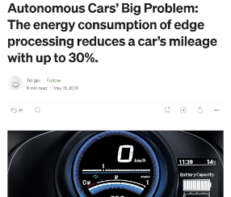

```{r setup, include=FALSE}
knitr::opts_chunk$set(echo = FALSE)
```


## Article Selected

The article that has been reviewed is an article from "@Teraki" that has been published in May 2019 in Medium application.\
\
[](Images/Screenshot_Title_Article_Resized.png)

## Problem it tries to address / Presented

"Autonomous Cars' Big Problem: The energy consumption of edge processing reduces a car's mileage with up to 30%"

https://medium.com/@teraki/energy-consumption-required-by-edge-computing-reduces-a-autonomous-cars-mileage-with-up-to-30-46b6764ea1b7

Information about Teraki: Teraki is a company located in Germany (Berlin) developing an artificial intelligence and edge processing platform. It's AI-powered software product operates at the embedded level and delivers for automotive and IoT applications (such as drones, robots, smartphones) for which they lower latencies, reduce costs and enhance machine learning accuracy with 10%-30% vs. state-of-the art.


## Structure of the Article (1/2)

Using available data from the US Gov.:\

1. Energy Capacity for a selection of cars\
2. Attainable mileage: showing proportionality & more consumption in cities\
3. Divide 1. by 2. to get the energy per 100 miles\
4. Time a car is able to drive with a full charge: using assumption on average speed\
5. Energy consumption on "Autonomous Driving (AD)" at L4/L5 * duration of the ride: making assumption on the power consumption when being in AD t L4/L5\
6. Divide the energy needed by a car on AD at L4/L5 with the energy stored in the full battery: Define the % of the battery that is consummed by activating the AD at L4/L5\

...


## Structure of the Article (2/2)

7. Estimatate of the mileage reach if the AD at L4/L5 is activated\
\
=> Conclusion: it is showing the importance of optimizing the usage of CPU, GPU and more importantly AD-sensors to maintain a good level of battery consumption whilst being in AD at L4/L5.\


## Steps in Graphs (1/2)
[](Images/Graphs_Article_1.png)


## Steps in Graphs (2/2)
[](Images/Graphs_Article_2.png)


## What problem is presented?

The aim of the article is to show through an analysis the impact of driving in "Autonomous Driving (AD)" on the battery comsumption to highlight the importance of optimizing all the elements that are in use when the AD is activated.


## Is the problem addressed effectively? (1/3)

The article is well sctructured, with enough details on the data used and the steps followed to reach the conclusion. \
The catchy affirmative headline can lead to suspicions on how the analysis was made and might not attract effectively the right targeted readers.\
\
Giving the detail over the database used, the steps that have been followed are allowing to go through the detail and fully understand what is trying to be shown.\
\
We can see also that the analysis is not as deep as initially thought and we can easily see what they wanted to achieve.

## Is the problem addressed effectively? (2/3)

With the 3 graphs below we can see that the impact follwing the assumption made on the energy consumption by sensors only.\

[](Images/Graphs_Article_3.png)

## Is the problem addressed effectively? (3/3)

The comparison between the 1st and last graph shows how the information is also used to "promote" the article and how the same information can be used in different ways.\

[](Images/Graphs_Article_4.png)

## Is it highlighting any other usages/problems?

The article is not only explaining the challenges faced on the battery consumption when being on AD.\
It also shows:\

- The different type of car usages depending on the type of roads/locations \
- The need to take into account the energy necessary by the sensors used in a car \

## Which scenario from the ADEME it is rooted from?

This article can be connected with the scenarios 1, 3 and 4 as the impact would be on optimizing energy consumption but also modify the type of mobility using less carbons.\
The scenarion though that is the closest is the "SCENARIO 3: TECHNOLOGIES VERTES".\

## Any Question?

Thank you!
